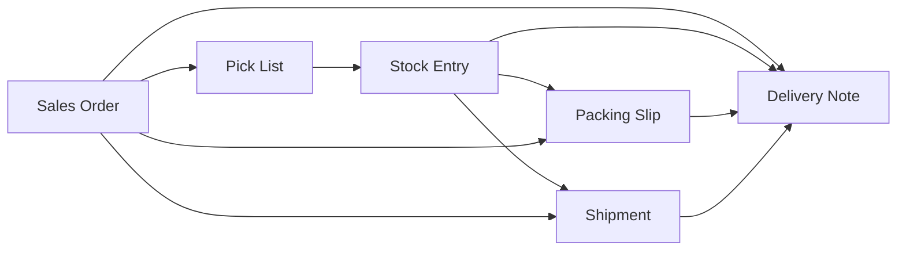

<!-- Copyright (c) 2026, AgriTheory and contributors
For license information, please see license.txt-->

# Alternative Sales Workflow

  Tyler Matteson 2026-09-02

## Purpose

When **Enable Alternative Sales Workflow** is checked on [Inventory Tools Settings](./index.md), Inventory Tools adds these sales paths without removing any existing ERPNext Create buttons.

Sites that want a narrower policy (for example, no Create → Delivery Note on the Sales Order) hide those buttons themselves.

## Enabled path graph

These edges are all available at once; they are not an exclusive pipeline:

## What Inventory Tools adds

| Start | Create button | Result |
|-------|---------------|--------|
| Submitted Sales Order | Packing Slip | Mapped draft Packing Slip (review and save in the form) |
| Submitted Sales Order | Shipment | Mapped draft Shipment (review and save in the form) |
| Submitted Material Transfer Stock Entry (with Pick List) | Delivery Note | Draft Delivery Note at the SE target warehouse |
| Same Stock Entry | Packing Slip / Shipment | Pack document with Sales Order lines at the SE target warehouse (no Delivery Note yet) |
| Submitted Packing Slip | Delivery Note | Map from Packing Slip lines and submit the Delivery Note |
| Submitted Shipment | Delivery Note | Map from Shipment lines and submit the Delivery Note |

## What stays unchanged

- Create → Delivery Note on the Sales Order
- Create → Pick List on the Sales Order
- Create → Sales Invoice from a submitted Delivery Note
- Create → Packing Slip / Shipment from a Delivery Note (including submitted-DN Shipment via ERPNext `make_shipment`)

## Delivery Note and stock

The Delivery Note remains the inventory-disposition document. Create → Packing Slip or Shipment from a Sales Order or staging Stock Entry builds the pack document directly from Sales Order lines; no Delivery Note is created until fulfillment. When the operator completes packing or shipping, Inventory Tools maps a Delivery Note from the pack document using the linked Sales Order for header fields (customer, addresses, taxes, rates) and pack line quantities, then submits it.

The mapper uses ERPNext `make_delivery_note` with `skip_item_mapping=True` so header and tax rows come from the Sales Order, then maps each pack line from its `so_detail` Sales Order Item (quantity from the pack row, warehouse from the linked Delivery Note Item or Sales Order Item).

Stock leaves the warehouse when the Delivery Note is submitted.

## Sales Order identity

Every document in the workflow graph carries Sales Order identity on its child rows:

| Document | Child table | Fields |
|----------|-------------|--------|
| Pick List | Pick List Item | `sales_order`, `sales_order_item` (ERPNext core) |
| Stock Entry | Stock Entry Detail | `against_sales_order`, `so_detail` |
| Delivery Note | Delivery Note Item | `against_sales_order`, `so_detail` (ERPNext core) |
| Packing Slip | Packing Slip Item | `against_sales_order`, `so_detail` |
| Shipment | Shipment Delivery Note | `against_sales_order`, `so_detail`, `item_code`, `qty` |

Inventory Tools copies these fields when creating maps (for example, Stock Entry from Pick List, Packing Slip from Delivery Note) and on validate when ERPNext creates a pack document from a draft Delivery Note.

## Shipment Delivery Note table

ERPNext’s stock Shipment child table is named **Shipment Delivery Note** and was built for the classic path: one row per **submitted Delivery Note**, with **Value** (`grand_total`) taken from that DN.

In Alternative Sales Workflow the same table becomes the **ship line list** when you create a Shipment from a Sales Order or staging Stock Entry:

| Phase | What each row represents | `delivery_note` | Other fields |
|-------|--------------------------|-----------------|--------------|
| Draft Shipment (SO path) | One pending Sales Order line | Empty | `against_sales_order`, `so_detail`, item, qty, line **Value** |
| After **Delivery Note** fulfillment | Same rows, now linked to the submitted DN | Set on every row | `dn_detail` stamped per line |

**Value** is still the line amount (for carrier declared value / `value_of_goods` rollup). It is not a placeholder for a missing DN.

When **Enable Alternative Sales Workflow** is on, Inventory Tools:

- Adds a **Delivery Note** link on the Shipment header (same pattern as Packing Slip), filled when you fulfill
- Hides the child-table **Delivery Note** column and makes it optional server-side
- Shows Sales Order, item, qty, and Value on each ship line instead

Use **Delivery Note** on the Shipment (or complete packing on a Packing Slip) to map and submit the DN; Inventory Tools then back-fills `delivery_note` on each row.

The classic ERPNext path (Shipment from submitted Delivery Note) is unchanged: rows still point at existing DNs from the start.

## Freight

When completing fulfillment from a Shipment, if `shipment_amount` is set (or an accepted Shipment Quotation exists when ShipStation Integration is installed), Inventory Tools copies the amount onto an existing Actual charge row whose description contains “ship”. Otherwise freight must be entered on the Delivery Note manually.