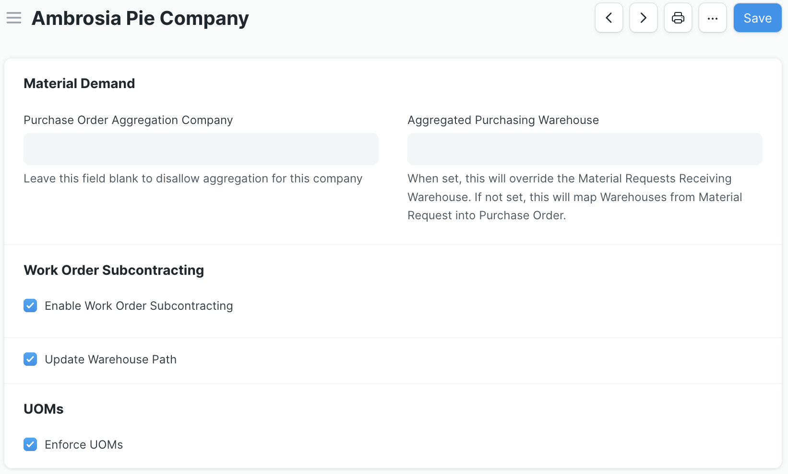

<!-- Copyright (c) 2024, AgriTheory and contributors
For license information, please see license.txt-->

# Inventory Tools Documentation

  Rohan Bansal, Devarsh Bhatt, coleandreoli, Ishwarya, Heather Kusmierz, Tyler Matteson, and Francisco Roldán 2026-01-26

The Inventory Tools application enhances and extends inventory-related functionality and workflows in ERPNext. It includes the following features:

- **[Material Demand](./material_demand.md)**: a report-based interface to aggregate required Items across multiple sources, then optionally create Purchase Orders or Request for Quotations
- **[Warehouse Path](./warehouse_path.md)**: for any warehouse selection field, this features helps clearly identify warehouses by creating a warehouse path and adding a human-readable string under the warehouse name in the format "parent warehouse(s)->warehouse"
- **[Subcontracting Workflow via Work Order](./wo_subcontracting.md)**: an alternative to ERPNext's subcontracting workflow that enables a user to employ Work Orders, subcontracting Purchase Orders, and manufacturing Stock Entries in lieu of Purchase Receipts or Subcontracting Orders/Receipts. Enhancements to the subcontracting Purchase Invoice allow a user to quickly reconcile what Items have been received with what is being invoiced
- **[Inline Landed Costing](./landed_costing.md)**: Coming soon! This features enables a user to include any additional costs to be capitalized into an Item's valuation directly in a Purchase Receipt or Purchase Invoice without needing to create a separate Landed Cost Voucher
- **[Manufacturing Capacity](./manufacturing_capacity.md)**: a report-based interface to show, for a given BOM, the entire hierarchy of any BOM tree containing that BOM with demand and in-stock quantities for all levels
- **[Faceted Search](./faceted_search.md)**: loosely-coupled attributes for Items, visible in both Ecommerce and Item Listview search contexts
- **[Alternate Workstation](./alternate_workstation.md)**: allows selecting alternative workstations that can perform the same operation
- **[Cartonization](./cartonization.md)**: Cartonization ensures that items involved in inventory transactions physically fit into their 
target containers
- **[Quarantine Quality Control](./quarantine_quality_control_workflows.md)**: allows inventory to be automatically moved to a quarantine warehouse for inspection, Items remain in quarantine until quality inspection is completed and approved.

## Configuration
Any feature in Inventory Tools may be toggled on or off via the Inventory Tools Settings document. The only exception to this is the Material Demand report, which is generally available upon installation of the app. There may be one settings document for each company in ERPNext to enable features on a per-company basis. Follow the links above for further details around feature-specific configuration.

## Installation
Full [installation instructions](https://github.com/agritheory/inventory_tools) can be found on the application's repository.

Note that the application includes a script to install example data to experiment and test the app's features. See the [Using the Example Data to Experiment with Inventory Tools page](./exampledata.md) for more details.
