# Material Demand

Material Demand is a report-based interface that allows you to aggregate required Items across multiple Material Requests, Suppliers, and requesting Companies. From there, you can create draft Purchase Orders (PO), draft Request for Quotations (RFQ), or a combination of the two based on the Item's configuration.

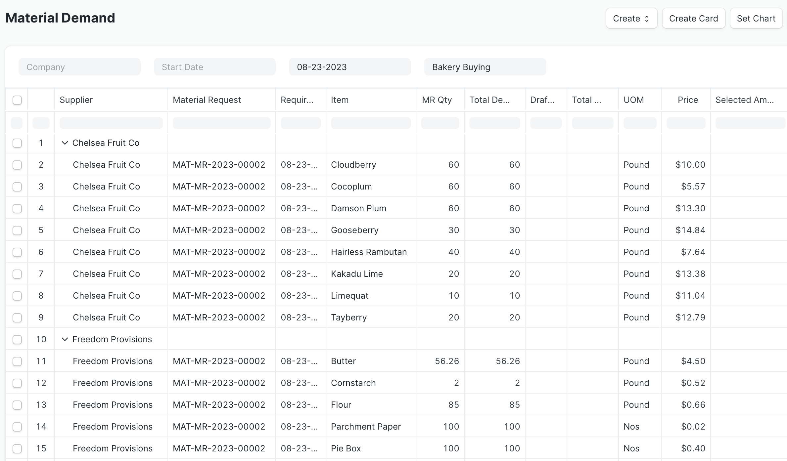

The right-hand side of the report has selection boxes to indicate which rows of Items to include to create the documents. Ticking the top-level supplier box will automatically check all the Items for that supplier. 

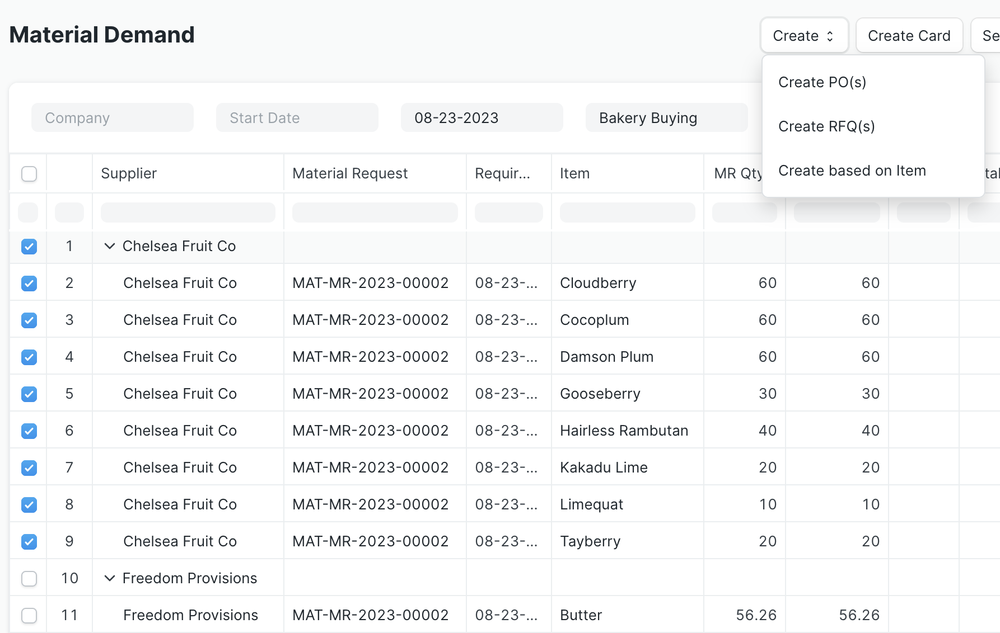

Once you're satisfied with your selections, clicking the Create button will give you three options to generate draft documents:

1. Create PO(s) will create a Purchase Order for each supplier selected. If there is more than one company requesting materials from the same supplier, it marks the PO as a Multi-Company Purchase Order
2. Create RFQ(s) will create a Request for Quotation for each supplier-item combination
3. Create based on Item will create RFQs and/or POs depending on how the Item's supplier list is configured (in the Item master)

All generated documents remain in draft status to allow you to make edits as needed before submitting them.

### Create Purchase Orders
If you select the Create PO(s) option, a dialog window will appear to select the Company if it hasn't already been supplied in the filter section.

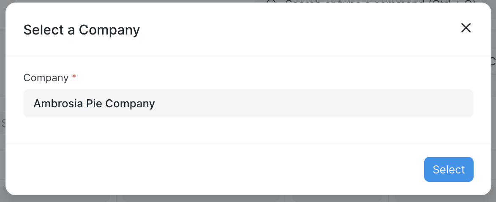

You can find the new documents in the Purchase Order listview.

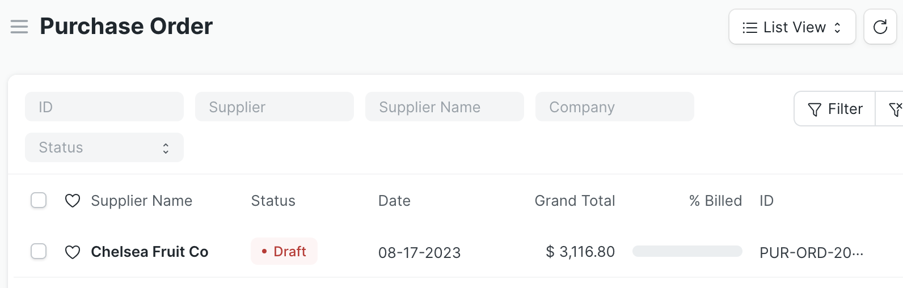

After generating the draft Purchase Orders, the Material Demand report updates to display the quantity ordered in the Draft PO column. Note that after you submit the Purchase Orders, the Items rows no longer show in the report.

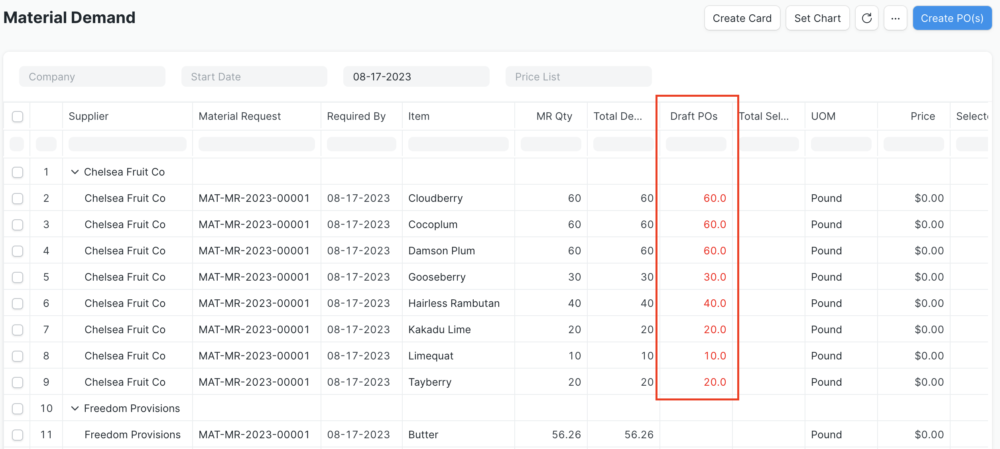

### Create Request for Quotation

If you select the Create RFQ(s) option, a dialog window will appear to select the Company and Email Template.

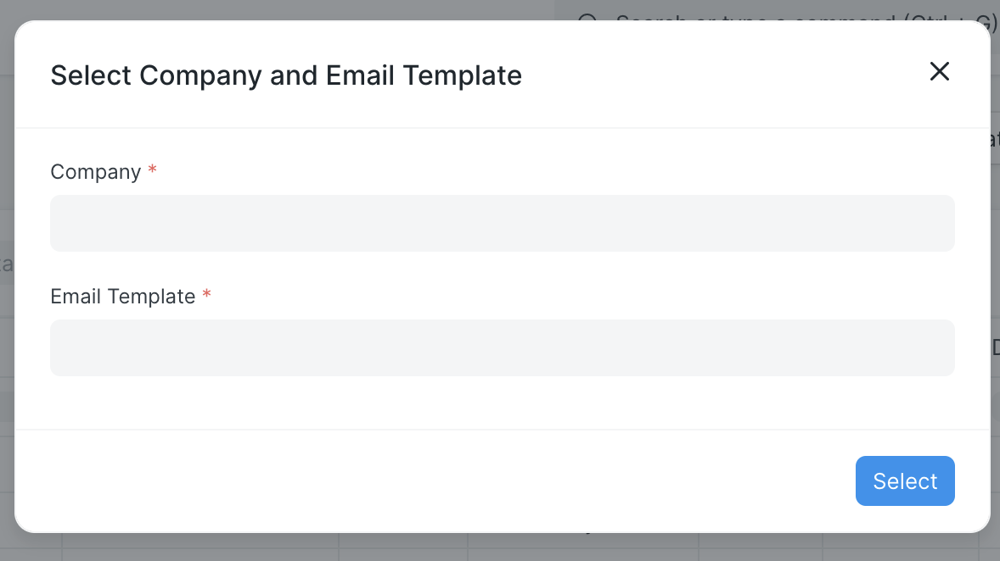

You can find the new documents in the Request for Quotation listview and make edits as needed before submitting them.

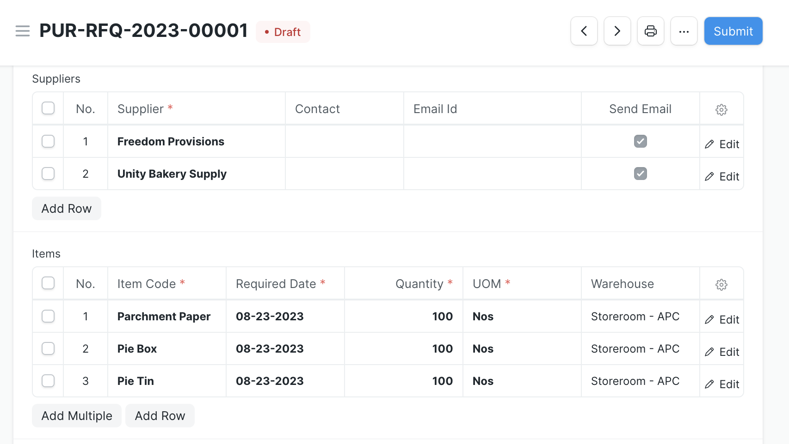

### Create Based on Item
The final option Create based on Item will create Purchase Orders and/or RFQs depending on how each Item's supplier list is configured in the Item master.

For a given Item, go to the Supplier Items table (found in the Purchasing tab's Supplier Details section) and click Edit for a Suppler. If you check the Requires RFQ? box, the Material Demand report will create an RFQ for that Item. If the box is left unchecked, the report generates a Purchase Order.

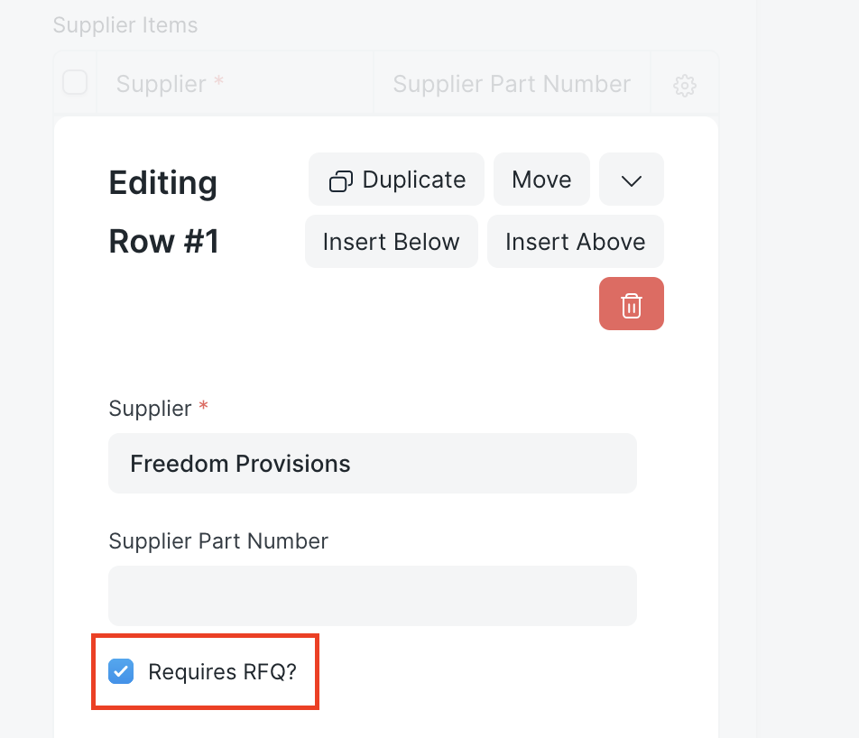

The selection process works the same as the other options.

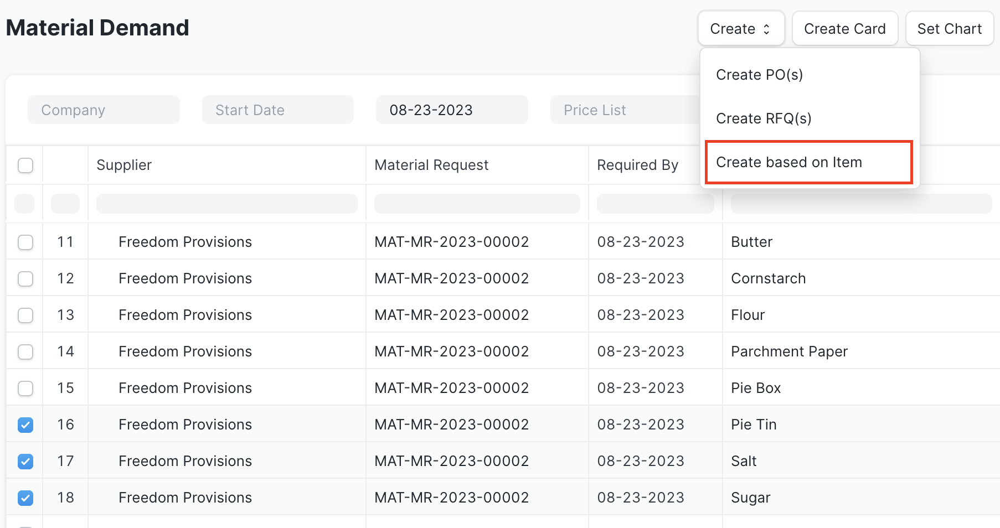

The report displays a banner to notify you of how many of each document were created.

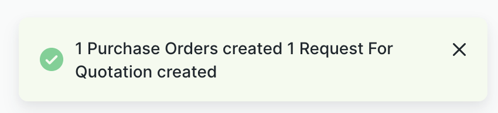

The Items in each document will correspond to the Item Supplier configuration. Since the Pie Tin Item is the only one that required an RFQ, it's included in the new RFQ, whereas the other Items are in the new Purchase Order.

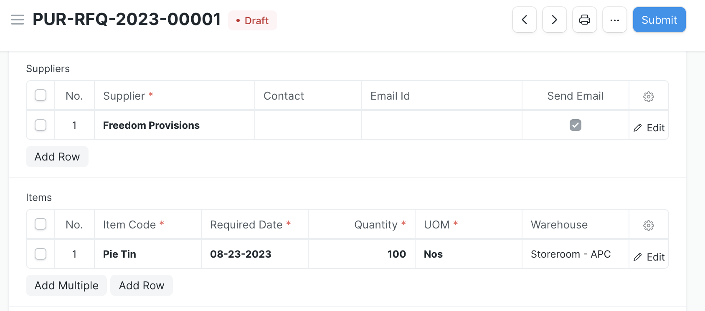

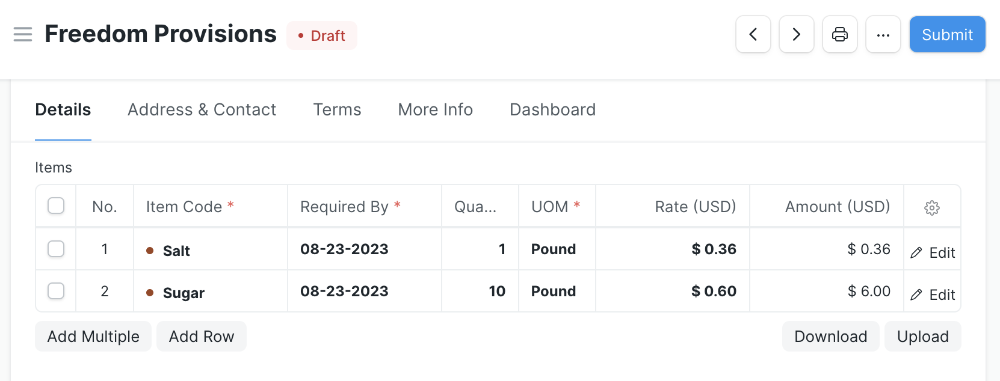

## Configuration
The Material Demand report is available on installation of the Inventory Tools application, but there are configuration options in Inventory Tools Settings to modify its behavior.

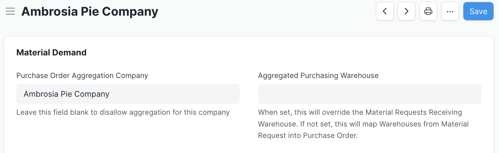

When the Material Demand report generates Purchase Orders, it fills the PO Company field with the company specified in the filter, or if that's blank, the one provided in the dialog window. To retain this default behavior, leave the Purchase Order Aggregation Company field in Inventory Tools Settings blank. However, if you populate this field, the report will use its value in the Purchase Order's Company field instead. In either case, if there's more than one company requesting materials from the same supplier, the report will select the Multi-Company Purchase Order box for that supplier's PO.

The Aggregated Purchasing Warehouse field has a similar impact on the report's behavior. By default, the field is blank and the Material Demand report applies the warehouses set per Item in the Material Request as the Item's warehouse in the new Purchase Order. If you set a value in this field, the report will instead use the specified warehouse for each Item in the Purchase Order.

See the Create Based on Item section for instructions on how to configure specific Item-Supplier combinations to require an RFQ.
