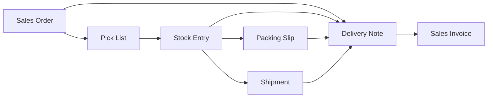

<!-- Copyright (c) 2026, AgriTheory and contributors
For license information, please see license.txt-->

# Sales Order Outbound Shipping

  AgriTheory 2026-08-27

## Purpose

When **Enable Sales Order Outbound Shipping** is checked on [Inventory Tools Settings](./index.md), Inventory Tools adds outbound paths without removing any existing ERPNext Create buttons.

Sites that want a narrower policy (for example, no Create → Delivery Note on the Sales Order) hide those buttons themselves.

## Enabled path graph

These edges are all available at once; they are not an exclusive pipeline:

## What Inventory Tools adds

| Start | Create button | Result |
|-------|---------------|--------|
| Submitted Sales Order | Packing Slip | Draft Delivery Note + Packing Slip |
| Submitted Sales Order | Shipment | Draft Delivery Note + Shipment (does not call ERPNext `make_shipment`) |
| Submitted Material Transfer Stock Entry (with Pick List) | Delivery Note | Draft Delivery Note at the SE target warehouse |
| Same Stock Entry | Packing Slip / Shipment | Draft Delivery Note + pack document |
| Submitted Packing Slip (draft DN linked) | Delivery Note | Submit the linked draft Delivery Note |
| Submitted Shipment (draft DN linked) | Delivery Note | Submit the linked draft Delivery Note |

## What stays unchanged

- Create → Delivery Note on the Sales Order
- Create → Pick List on the Sales Order
- Create → Sales Invoice from a submitted Delivery Note
- Create → Packing Slip / Shipment from a Delivery Note (including submitted-DN Shipment via ERPNext `make_shipment`)

## Delivery Note and stock

The Delivery Note remains the inventory-disposition document. Packing Slip and Shipment still require a linked Delivery Note in Phase 1; the new maps create that document as a **draft** and leave it unsubmitted until the operator completes fulfillment from the pack document.

Stock leaves the warehouse when the Delivery Note is submitted.

## Freight

When completing fulfillment from a Shipment, if `shipment_amount` is set (or an accepted Shipment Quotation exists when ShipStation Integration is installed), Inventory Tools copies the amount onto an existing Actual charge row whose description contains “ship”. Otherwise freight must be entered on the Delivery Note manually.

## Configuration

**Inventory Tools Settings → Outbound Shipping → Enable Sales Order Outbound Shipping**

Default: off.

## Phase 2 (not in this release)

Pack/shipment lines keyed by Sales Order Item (`so_detail`), optional Delivery Note on pack documents, and Stock Reservation from pack documents.
