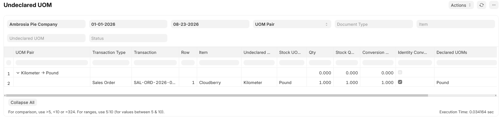

<!-- Copyright (c) 2026, AgriTheory and contributors
For license information, please see license.txt-->

# Undeclared UOM

  AgriTheory 2026-08-23

ERPNext lets you post stock transactions in a UOM that is not listed on the Item's **UOM Conversion Detail** table (the Item child table named **UOMs**). When that happens, `get_conversion_factor` may fall back to a global conversion or default the factor to **1** — so quantities can be recorded as if 1 Kilometer equals 1 Pound. You can restrict UOM selection in the transaction UI by enabling **Stock Settings → Allow UOM with conversion rate defined in Item**; that setting is site-wide and applies to all Companies and Items.

The **Undeclared UOM** report finds submitted (and optionally draft or cancelled) transaction lines whose UOM is missing from that Item's conversion table. It is a discovery tool only: it does not block saves, amend documents, or write conversion rows for you.

## What counts as a finding

A line is included when **all** of the following are true:

- The line has an **Item** and a **UOM**.
- That UOM is **not** a row on the Item's **UOM Conversion Detail** table (`parent` = item code, `uom` = line UOM).
- The parent document matches the report filters (company, date range, status, and optional document type / item / UOM filters).

This is the same membership test ERPNext uses when **Stock Settings → Allow UOM with conversion rate defined in Item** restricts the UOM picker in transactions. The report applies that test to **existing** lines across many document types.

The report does **not** flag:

- Lines where the UOM **is** on the conversion table but the stored **conversion factor** differs from the item master.
- Fallbacks through the global **UOM Conversion Factor** doctype (only the item table is consulted).
- **BOM Item**, **Work Order**, or **Item Price** rows (out of scope for this report).

Variant items are checked against the **variant's own** conversion table, not the template item.

## Where to find it

Open **Undeclared UOM** from the Awesome Bar or under **Inventory Tools** reports after `bench migrate` installs the report fixture.

## Filters

| Filter | Purpose |
|--------|---------|
| **Company** | Required. Limits results to one company. |
| **From Date / To Date** | Required. Uses the parent document's transaction or posting date (Pick List uses creation date). |
| **Group By** | **UOM Pair** (default) or **Document**. Controls tree grouping. |
| **Document Type** | Optional. Restricts which parent doctypes are scanned; leave blank for all. |
| **Item** | Optional. Only lines for this item. |
| **Undeclared UOM** | Optional. Only lines using this UOM. |
| **Status** | **Draft**, **Submitted**, and/or **Cancelled**. Default is **Submitted**. |

## Report output

Results are shown as a **tree**: a summary row (indent 0) with detail lines beneath it (indent 1).

### Group by UOM Pair

Summary rows are labeled `{undeclared_uom} → {stock_uom}` (for example `Kilometer → Pound`). **Line Count** is the number of transaction lines in that group; **Identity Count** is how many of those lines have **Identity Conversion** set.

### Group by Document

Summary rows are labeled `{Transaction Type} {name}` (for example `Sales Order SAL-ORD-2026-00001`). All undeclared lines on that document appear as children.

### Line columns

| Column | Meaning |
|--------|---------|
| **Transaction Type / Transaction** | Parent doctype and document name (link). |
| **Row** | Child table row number. |
| **Item** | Item code on the line. |
| **Undeclared UOM** | UOM on the line that is not on the item's conversion table. |
| **Stock UOM** | Item stock UOM on the line (or from the Item master for Packed Item rows). |
| **Qty / Stock Qty** | Quantities as stored on the line (`transfer_qty` for Stock Entry Detail). |
| **Conversion Factor** | Factor stored on the line. |
| **Identity Conversion** | Checked when conversion factor is **1** and undeclared UOM ≠ stock UOM — the unsafe 1:1 case. |
| **Declared UOMs** | Comma-separated UOMs currently on the item's conversion table. |

## Documents scanned

**Sales:** Quotation, Sales Order, Delivery Note, Sales Invoice, POS Invoice (including **Packed Item** children where applicable).

**Buying:** Request for Quotation, Supplier Quotation, Purchase Order, Purchase Receipt, Purchase Invoice.

**Stock:** Material Request, Stock Entry, Pick List.

**Subcontracting:** Subcontracting Order, Subcontracting Receipt (lines use stock UOM only; findings are uncommon unless the item table is incomplete).

## Fixing findings

Each row points at a specific document line. Typical cleanup paths:

1. **Correct the transaction** — amend or cancel/re-enter the line with a declared UOM and the right conversion factor.
2. **Update the item master** — add the UOM and conversion factor to the Item **UOMs** table if that UOM is genuinely valid for the item (then re-run the report to confirm the line drops off).

There are no repair actions on the report itself.

## Prevention

To stop new lines from using undeclared UOMs in the UI, enable **Stock Settings → Allow UOM with conversion rate defined in Item**. That limits the UOM link field to rows on the item's conversion table but does **not** validate on the server for most transaction types — so the **Undeclared UOM** report remains useful for auditing historical data and anything entered before the setting was turned on.

Inventory Tools previously exposed a similar **Enforce UOMs** setting; that toggle is deprecated in favor of ERPNext's Stock Settings field.
