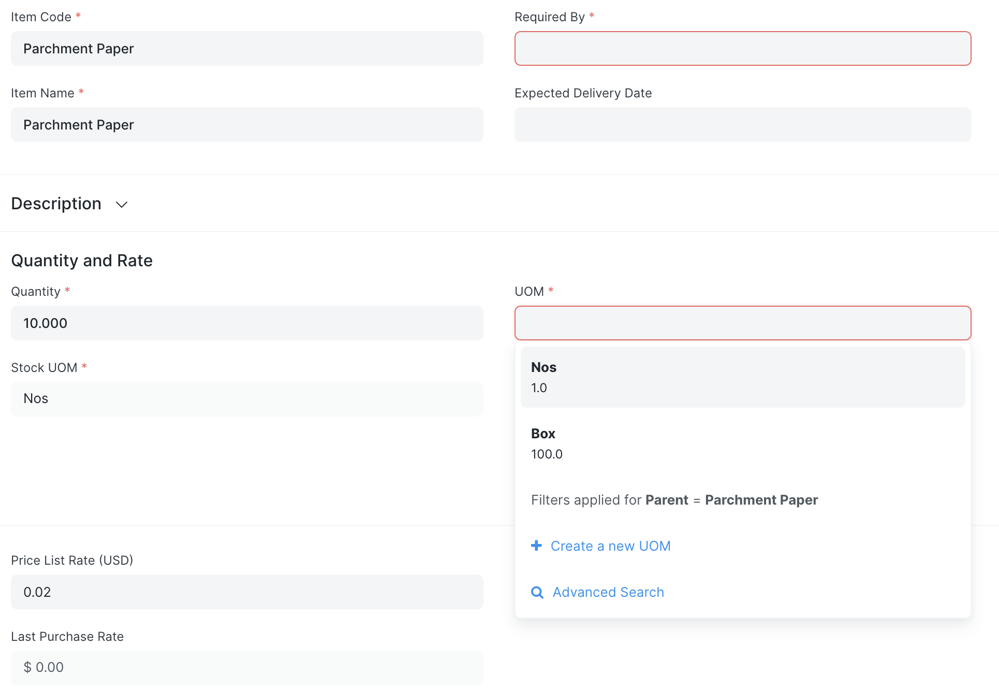

# UOM Enforcement

By default, ERPNext allows its users to select any Unit of Measure (UOM) for any Item. If no conversion ratio exists between the UOM selected and the Item's stock UOM, ERPNext assumes it should be 1:1. This feature enforces that a user is only able to select and use valid UOMs. If an Item has no way to be understood in "Linear Feet" or "Volts", those UOMs will not be included as options in any UOM field for that Item.

The following example shows the Parchment Paper Item has two defined UOMs in the Item master.


In a Purchase Order, the Edit Item form for Parchment Paper has only two options in the UOM field - the two defined UOMs from the Item master.



## Configuration
To enable this feature, check the "Enforce UOMs" box in Inventory Tools Settings.

## Extending or Overriding This Feature
In the event you need to enter arbitrary UOMs in a specific doctype, you can selectively override this feature in your custom app. The following example shows how to override UOM enforcement in the Opportunity doctype.

```python
# custom_app/hooks.py
inventory_tools_uom_enforcement = {
  "Opportunity": {"Opportunity Item": {"items": []}},
}
```
Here we have removed "uom" from the list of fields to check.

To extend this feature to a custom doctype, follow the pattern established in the configuration object:

```python
# custom_app/hooks.py
inventory_tools_uom_enforcement = {
	"My Custom Doctype": {
		"My Custom Doctype": ["uom"] # a UOM field at parent/ form level
		"My Custom Doctype Child Table": {"items": ["uom", "weight_uom", ]}, # UOM fields in a child table
		"My Second Custom Doctype Child Table": {"mistakes": ["uom", "weight_uom", ]}, # UOM fields in a second child table
	},
}
```

