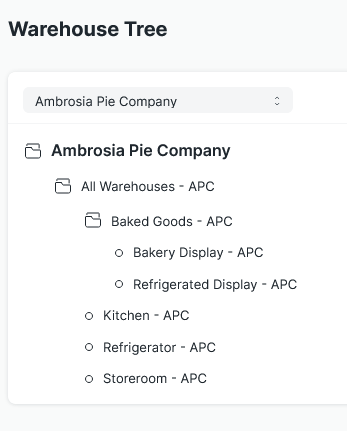
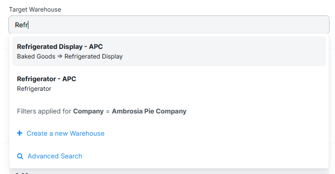

# Warehouse Path
ERPNext allows its user to construct hierarchial abstractions for their physical facilities. This can make it difficult to know when you are selecting a Warehouse if it is "Bin A" in the "Storage Closet" or if is "Bin A" from the "Repair Supplies" Warehouse.

This feature encodes the Warehouse hierarchy into a string, which becomes searchable, and allows the user to more easily understand which Warehouse they are selecting.

## Example
In this example there are two Warehouses that start with "Refridger..." and while they are different, they could be mixed up.

In the Link dropdown, the full path is given, omitting the root "All Warehouses - APC" and the company abbreviation at each level. 

This view shows the user-provided search text of "Refr..." matches the two similarly-named Warehouses. The Warehouse path under each option's name clearly distinguishes the choices by specifying each Warehouse's hierarchy.

## Configuration
To enable this feature, check the "Update Warehouse Path" box in Inventory Tools Settings.
