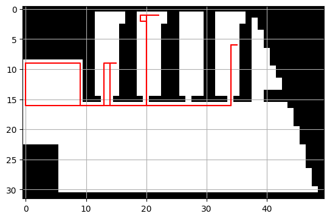
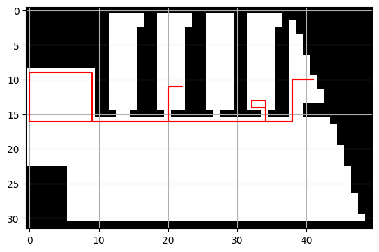

<!-- Copyright (c) 2025, AgriTheory and contributors
For license information, please see license.txt-->

# Warehouse Plan

<div class="byline">
  Tyler Matteson 2026-05-07
</div>


## Overview

The Warehouse Plan feature's goal is to optimize the walking time and calculate the shortest path of a pickup list within a warehouse. Additionally, `FIFO`, `LIFO`, `Deplete_Max_Bins`, and `Deplete_Min_Bins` rules can be applied to the available stock for optimal stock management. This is accomplished by using a physical representation layer and implementing a pathing algorithm to solve for the shortest path, combined with pickup rules.

**Note**: In Frappe, a warehouse is anything that has storage and can contain internal *warehouses*. A building is a warehouse, which contains a bin, which is a warehouse, which contains a box, which is a warehouse. 

## Methodology
The physical representation is a 2D projection on top of a **floor plan drawing**. This 2D layer is then broken up into a **grid overlay**, defining walkable and non-walkable areas and internal wall and path geometries, stored in the **matrix**. The grid is ideally the lowest possible resolution (number of boxes) to cover walkable areas. The goal is to capture the spatial representation, which doesn't require high-definition mapping. Then the **Warehouses/Bins** locations and sizes are defined. They are meant to be placed on a non-walkable square with a defined access point on a walkable square. A **Pick lists** defines the items required for pickup; however, the order and rules are unoptimized. We then apply the pickup rules and pathing algorithm. The **pathing algorithm** then finds the shortest path with the connected (vertical and horizontal, not corner) walkable tiles, between access points of the bins. The pick list is then updated with the newly optimized list.

**floor plan** -> **grid overlay** -> **walkable/non-walkable matrix** -> **warehouses** -> **pick list** -> **shortest path algorithm**

## WarehousePlan Doctype
This doctype is used to define and store the physical representation layer of the warehouse
- `floor_plan`: An image of the floor plan (eg, Scale drawing, Architectural drawing)
- `uom`: The unit of measure of the floor_plan (feet, meters, etc.)
- `group_warehouse`: The name of the root warehouse
- `horizontal`: The physical width of the plan
- `vertical`: The physical height of the plan
- `offset`: Used to align the floor plan image with the box view
- `matrix`: Stores walkable/non-walkable information of the grid, representing walls, obstacles, and walkways
- `pickup_point_x`: Defines the horizontal start and end location of the pathing algorithm
- `pickup_point_y`: Defines the vertical start and end location of the pathing algorithm
- `company`: The company that owns the warehouse

## Examples
### Method: FIFO
```
[{'item_code': 'Bayberry', 'qty': 17.0, 'warehouse': 'Fruit Storage 11 - CFC'},
 {'item_code': 'Lychee', 'qty': 3.0, 'warehouse': 'Fruit Storage 49 - CFC'},
 {'item_code': 'Kepel', 'qty': 12.0, 'warehouse': 'Fruit Storage 21 - CFC'},
 {'item_code': 'Bayberry', 'qty': 3.0, 'warehouse': 'Fruit Storage 14 - CFC'}]
Distance: 156.0
```


In this example, using the FIFO rule, Bayberry in Fruit Storage 11 was insufficient, so the remaining quantity was taken from Fruit Storage 14. Then the pickup list order was optimized to achieve the shortest path.

### Method: LIFO
```
[{'item_code': 'Bayberry', 'qty': 20.0, 'warehouse': 'Fruit Storage 57 - CFC'},
 {'item_code': 'Kepel', 'qty': 12.0, 'warehouse': 'Fruit Storage 45 - CFC'},
 {'item_code': 'Lychee', 'qty': 3.0, 'warehouse': 'Fruit Storage 25 - CFC'}]
Distance: 132.0
```
