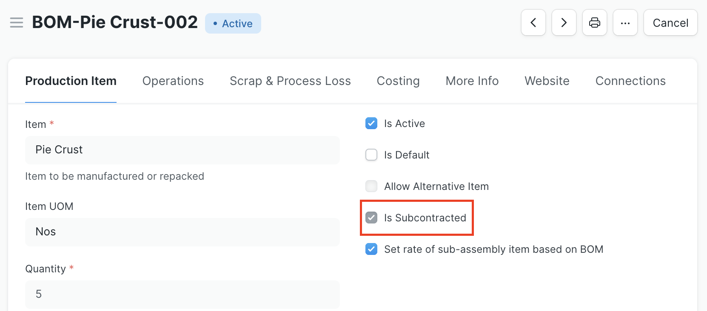
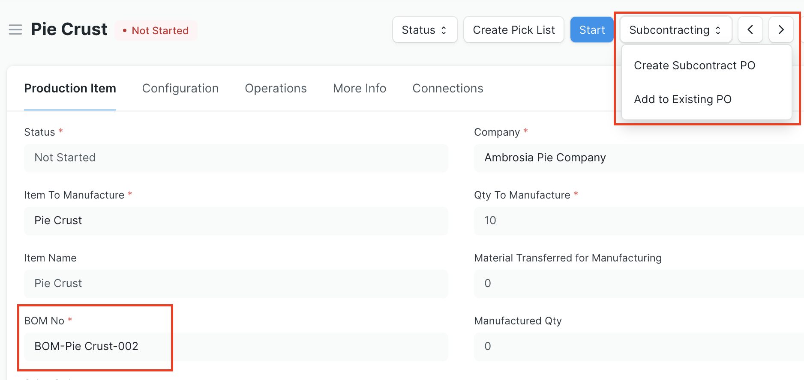
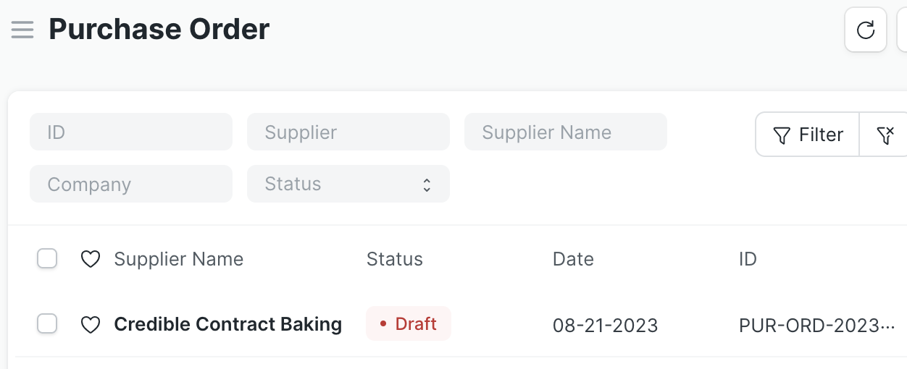
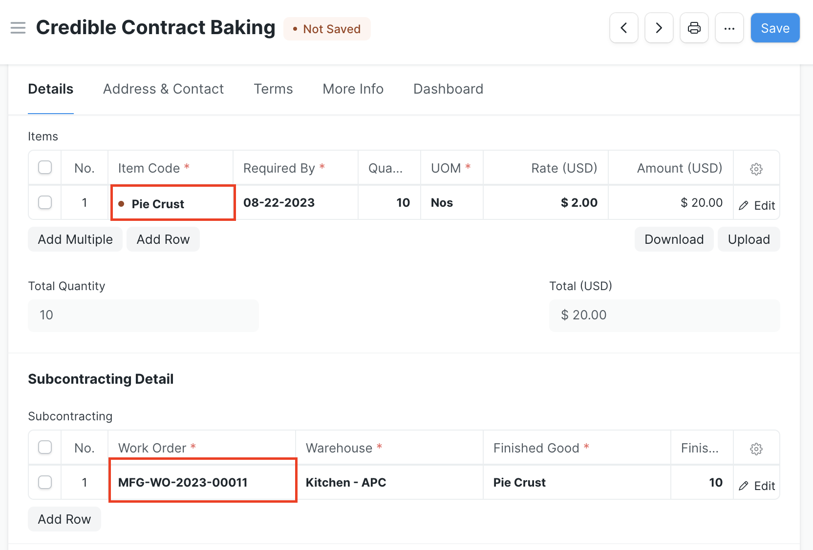
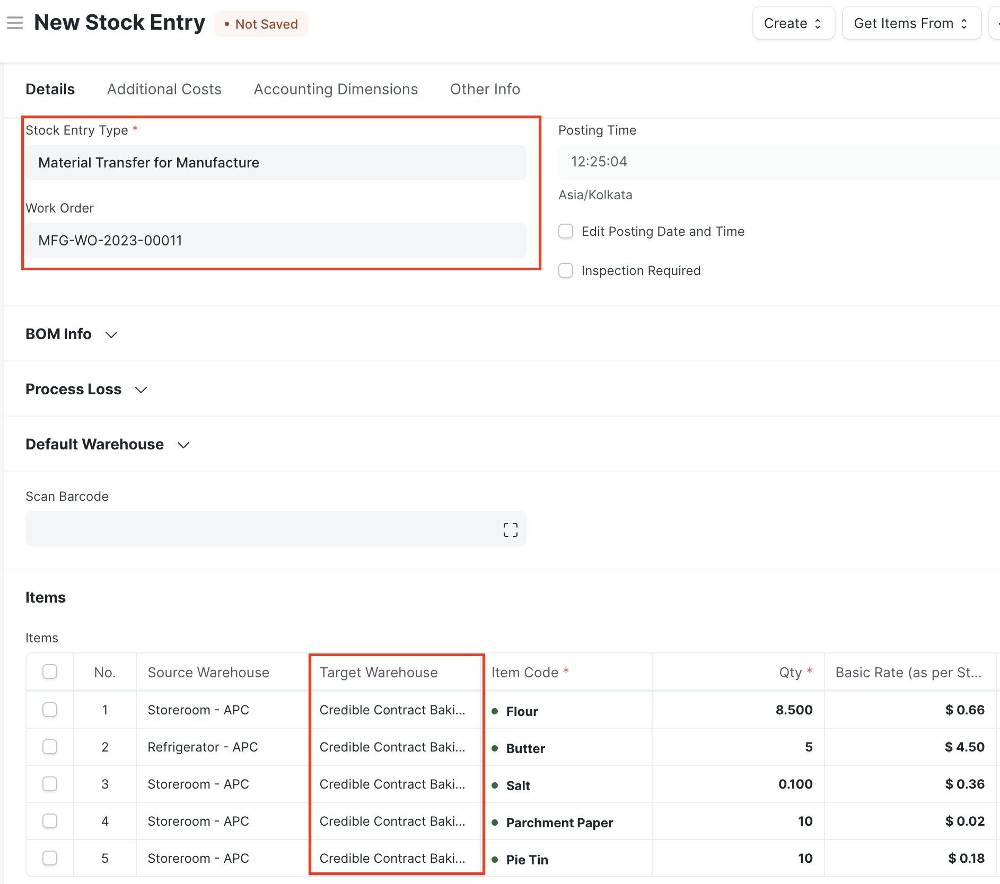
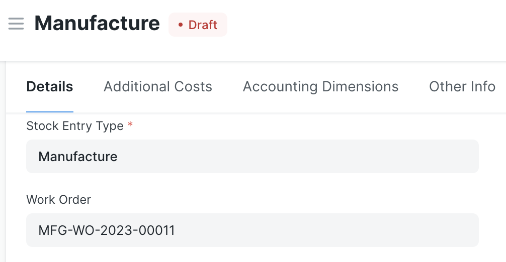
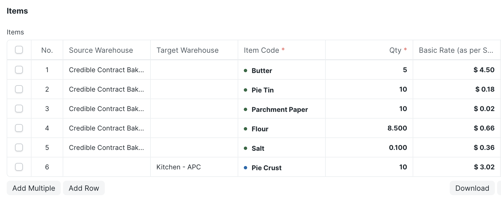
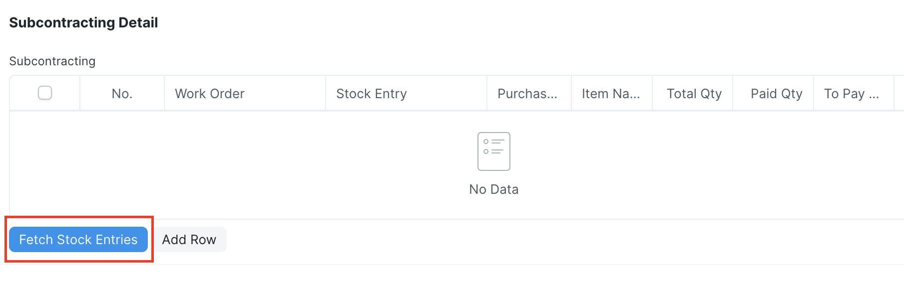

# Subcontracting Workflow via Work Order

ERPNext's subcontracting workflow has changed substantially with each version release of the software, generally without backwards compatibility. This feature offers an alternative to using a Purchase Receipt or the Version-14 Subcontracting Order and Subcontracting Receipt documents. Instead, it allows you to manage the subcontracting process with Work Orders, Purchase Orders and Invoices, and Stock Entries.

## Configuration
To enable this feature, check the "Enable Work Order Subcontracting" box in Inventory Tools Settings.

The feature also has the following prerequisite configuration to get it up and running:

- Items:
    - For any subcontracted Item, check the Supply Raw Materials for Purchase box. This is found in the Manufacturing section of the Item master
    - Optional: create a service Item (uncheck the Maintain Stock box in the Item master) to represent the services provided by the subcontractor. The ERPNext workflow requires service Items in subcontracted Purchase documents, however this is completely optional in this feature. Instead, when a subcontracted Purchase Order is created from a Work Order, the finished good received from the subcontractor will populate the Items section of the form
- Warehouses:
    - create a dedicated warehouse for each subcontractor to track materials sent to them
- Bill of Materials (BOM):
    - Create a BOM for the subcontracted Item that includes raw materials supplied to the subcontractor and check the Is Subcontracted box. This BOM should not include any operations, as they are done by the subcontractor
    - The feature supports processes done at times in-house and at times by a subcontractor. There should be separate BOMs for each process, with the appropriate one linked to in the Work Order

## Work Orders
This feature starts with a Work Order for a subcontracted Item. As noted in the Configuration section, there should be a BOM in the system for the Item, which lists all the raw materials supplied to the subcontractor, no operations, and has the Is Subcontracted box checked.

The Work Order should tie to the subcontracted BOM. Once you submit the Work Order, you'll see a Subcontracting button with the options to create a new subcontracting Purchase Order (PO) or add the Item to an existing one.

### Create a New Purchase Order
If you click Create Subcontract PO, you'll see a dialog to enter the supplier, then the system generates a draft Purchase Order.

By default, the new subcontracting Purchase Order adds the same Item as what is being manufactured in the Work Order. This can be changed as needed. There's also a new Subcontracting Detail section with a table that tracks any Work Order(s) linked to the PO. The table includes the Work Order name, Warehouse, finished good Item name, BOM name, quantity, and UOM information.

### Add to an Existing Purchase Order
If you click Add to Existing PO, you'll see a dialog to select the applicable Purchase Order. The options are limited to non-cancelled, subcontracted POs only. Note that if the selected PO is already submitted, this action will cancel and amend that PO to include the additional Items from the Work Order and keep it in draft status until you review and submit it.

### Stock Entries
This workflow expects you to utilize Stock Entries to record raw material transfers to the subcontractor and to receive subcontracted finished goods into inventory. This part of the process retains default ERPNext behavior. You can create a Stock Entry of type Material Transfer for Manufacture against the Work Order to track raw materials going to the subcontractor. The Target Warehouse for Items should be a dedicated warehouse in the system for the subcontractor.

When the subcontractor delivers finished Items, a Stock Entry of type Manufacture records the consumption of raw materials from the subcontractor's warehouse and the receipt of Items into the appropriate company warehouse.

### Purchase Invoice and Stock Entry Reconciliation
At invoice time, this feature includes a reconciliation tool in the Purchase Invoice (PI) to compare Items ordered from the subcontractor with what has been received and what has been paid for. Click the Fetch Stock Entries button under the Subcontracting table to collect all Stock Entries of type Manufacture for subcontracted goods. A dialog window allows you to (optionally) narrow the selections within a date range.

The results of all valid stock entries populate the Subcontracting table, and show the Work Order name, Purchase Order name, Item name, total quantity, the quantity that's been paid for already (Paid Qty), and the outstanding quantity remaining (To Pay Qty).

In the example, the Purchase Invoice covers two Purchase Orders (each generated off of a Work Order) for 50 and 10 Pie Crusts, respectively. A separate PI already covered 20 Pie Crusts, as shown in the Paid Qty column, so there are only 40 remaining un-invoiced Pie Crusts. The Accepted Qty field in the Items table can be adjusted to capture only what remains to be invoiced.

